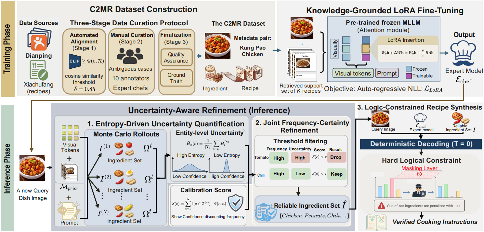

# **Rᴇᴄɪᴘᴇ**: Towards Hallucination-Free Recipe Generation with Entropy-Aware Logic Constraints

[](LICENSE)  

This repository contains the official implementation of the paper **"Closing the Visual-Culinary Gap: Towards Hallucination-Free Recipe Generation with Entropy-Aware Logic Constraints"**, submitted to **ACM MM 2026**.

## 🌟 Introduction

**Rᴇᴄɪᴘᴇ** (REtrieval-constrained Culinary Inference via Probabilistic Entropy) reformulates multimodal recipe generation from a probabilistic guessing task into a **verifiable logical reasoning** task. By quantifying epistemic uncertainty (entropy) via stochastic sampling, Rᴇᴄɪᴘᴇ effectively identifies and excises bias-driven "stubborn hallucinations."

<div align="center">
 
</div>

### Key Features
*   **Knowledge-Grounded LoRA Alignment:** Injects domain-specific culinary priors into MLLMs using a non-parametric memory bank and parameter-efficient fine-tuning.
*   **Entropy-Driven Uncertainty Quantification:** Executes multiple stochastic sampling trajectories to capture the model's internal hesitation, effectively distinguishing visual evidence from dataset bias.
*   **Joint Frequency-Certainty Refinement:** Establishes a non-linear decision boundary to isolate verified ingredients ($\hat{I}$) by fusing statistical frequency with normalized entropy.
*   **Logic-Constrained Synthesis:** Implements a Trie-based Finite State Machine (FSM) to enforce verified ingredients as hard constraints via dynamic logits masking.

## 📁 Project Structure

```text
.
├── data/                           # Dataset directory
│   ├── C2MR.json                   # Expert-vetted set (32072, pairs)
│   ├── C2MR_train.json             # Training set
│   ├── C2MR_val.json               # Validation set for LoRA monitoring
│   └── C2MR_test.json              # Test set for zero-hallucination evaluation
├── image_cache/                    # Cached images downloaded from URLs
├── src/                            # Core source code
│   ├── data_loader.py              # High-fidelity data parsing and ingredient cleaning
│   ├── retrieval.py                # Cross-modal retrieval using Chinese-CLIP-ViT-L/14
│   ├── recipe.py                   # Uncertainty quantification and Logits Masking logic
│   └── evaluation.py               # Corpus-level evaluation (BLEU, CIDEr, CHAIR_i)
├── train_lora.py                   # Training the expert model
├── main.py                         # Inference Pipeline: Running the Recipe framework
├── download_qwen                   # download qwen model to local
├── download_wordnet.py             # Helper to setup METEOR dependencies
└── requirements.txt                # Python dependencies
```

## ⚙️ Setup & Installation

The implementation is optimized for **NVIDIA RTX 4090 / A100 GPUs** running **Ubuntu 22.04** with **Python 3.10** and **PyTorch 2.1.1**.

1. **Create Environment**
    ```bash
    conda create -n recipe python=3.10
    conda activate recipe
    pip install torch==2.1.1 torchvision==0.16.1 --index-url https://download.pytorch.org/whl/cu118
    pip install -r requirements.txt
    ```

2. **Setup Metrics Dependency**
    Due to network constraints in certain regions, use our helper to setup NLTK WordNet:
    ```bash
    python download_wordnet.py
    ```

## 🚀 Usage

### 1. Expert Model Training
Fine-tune the backbone MLLM (Qwen-VL) on the training set:
```bash
python train_lora.py
```

### 2. Hallucination-Free Inference
Execute the RECIPE framework on the test set to generate recipes and evaluate performance:
```bash
python main.py
```

## 🔬 Reproducibility

*   **C2MR Dataset:** The Chinese Cross-Modal Recipes dataset contains 32,072 meticulously curated image-recipe pairs with expert-vetted annotations.
*   **Zero-Hallucination Frontier:** By setting the refinement threshold $\tau = 0.75$ and sampling paths $N = 5$, Recipe achieves state-of-the-art precision (>93.5%).
*   **Hyperparameters:** All critical parameters (LoRA rank, scaling factor, entropy normalization) are documented in `src/config.py` and the paper appendix.

## 🖋️ Citation

If you use Recipe or the C2MR dataset in your research, please cite:

```bibtex
@inproceedings{recipe2026,
  title={Closing the Visual-Culinary Gap: Towards Hallucination-Free Recipe Generation with Entropy-Aware Logic Constraints},
  author={Anonymous Author(s)},
  booktitle={Proceedings of the 34th ACM International Conference on Multimedia (ACM MM)},
  year={2026}
}
```
